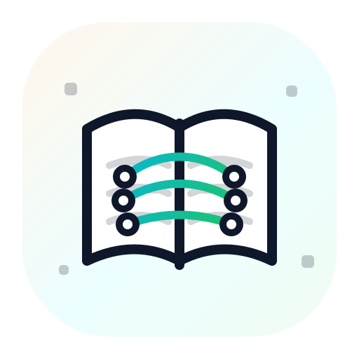

  

# AI Reading Club

A lightweight GitHub repo to run an AI Reading Club around foundational LLM papers.

## Logistics

- Cadence: Biweekly (one paper every two weeks)
- Format: 10-15 minute volunteer summary, then ~45 minutes discussion
- Joining (Discord): https://discord.gg/QhteuPUNYt
- Schedule: `sessions/schedule-2026.md` (starts 2026-03-04, Wednesdays; August is off)

See:

- `docs/announcement-template.md` (copy/paste announcement)
- `docs/why-read.md` (motivation)
- `docs/organizer-tips.md` (practical tips)

## Curriculum (13 papers, reordered)

### Module 1: Foundations & Architecture

1. Neural Machine Translation of Rare Words with Subword Units (2015)
2. Attention Is All You Need (2017)

### Module 2: Interpretability (Inside the Black Box)

3. What Does BERT Look At? An Analysis of BERT's Attention (2019)
4. Attention is not Explanation (2019)
5. Transformer Feed-Forward Layers Are Key-Value Memories (2020)

### Module 3: Generation & Decoding

6. The Curious Case of Neural Text Degeneration (2019)

### Module 4: The Data Foundation

7. Datasheets for Datasets (2018)

### Module 5: Efficiency & Scaling

8. FlashAttention: Fast and Memory-Efficient Exact Attention with IO-Awareness (2022)
9. LLM.int8(): 8-bit Matrix Multiplication for Transformers at Scale (2022)

### Module 6: Fine-Tuning & Alignment

10. LoRA: Low-Rank Adaptation of Large Language Models (2021)
11. QLoRA: Efficient Finetuning of Quantized LLMs (2023)
12. The Flan Collection: Designing Data and Methods for Effective Instruction Tuning (2023)
13. LIMA: Less Is More for Alignment (2023)

More detail (including rationale and links) lives in `curriculum/README.md`.

## How To Run Sessions

- Create one GitHub issue per paper (use the "Paper Session" issue template).
- Pick a discussion lead per session; they prepare a short summary deck or doc.
- Add 3 guiding questions up front to avoid a cold start.
- If the math gets heavy, focus on the abstract, intro, diagrams, and conclusion.

## Repo Layout

- `curriculum/`: the ordered reading list + paper links
- `docs/`: announcement + organizer docs
- `sessions/`: meeting notes and templates
- `.github/`: issue templates and PR template
