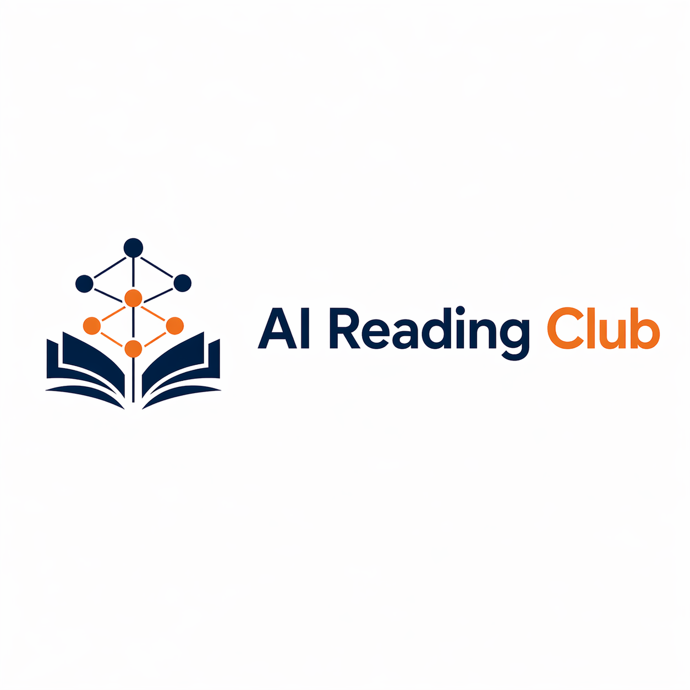

  

# AI Reading Club

A lightweight repository for running an AI Reading Club on foundational papers in modern language models.

Positioning:

> From papers to executable understanding.

The club reads foundational AI papers, discusses what they really mean, and connects them to modern LLM systems. Some sessions now pair with executable workshop artifacts in [`hghalebi/rust-ml`](https://github.com/hghalebi/rust-ml), especially for Rust, typed tiny ML, and category-theory-inspired reconstruction.

## Logistics

- Cadence: one paper every two weeks
- Format: 10-15 minute volunteer overview, followed by about 45 minutes of discussion
- Joining (Discord): https://discord.gg/5rAMsuVXXp
- Schedule: `sessions/schedule-2026.md` (started on 2026-03-11; confirmed history is tracked in `docs/workshop-history.md`; no sessions in August)

See:

- `docs/workshop-history.md` (confirmed session and workshop archive)
- `docs/announcement-template.md` (announcement template)
- `docs/why-read.md` (motivation)
- `docs/organizer-tips.md` (organiser tips)

## Curriculum (14 Papers)

### Module 1: Foundations and Architecture

1. Neural Machine Translation of Rare Words with Subword Units (2015)
2. Attention Is All You Need (2017)

### Module 2: Interpretability (Inside the Black Box)

3. What Does BERT Look At? An Analysis of BERT's Attention (2019)
4. Attention is not Explanation (2019)
5. Transformer Feed-Forward Layers Are Key-Value Memories (2020)

### Module 3: Generation and Decoding

6. The Curious Case of Neural Text Degeneration (2019)

### Module 4: The Data Foundation

7. Datasheets for Datasets (2018)
8. Croissant: A Metadata Format for ML-Ready Datasets (2024)

### Module 5: Efficiency and Scaling

9. FlashAttention: Fast and Memory-Efficient Exact Attention with IO-Awareness (2022)
10. LLM.int8(): 8-bit Matrix Multiplication for Transformers at Scale (2022)

### Module 6: Fine-Tuning and Alignment

11. LoRA: Low-Rank Adaptation of Large Language Models (2021)
12. QLoRA: Efficient Finetuning of Quantized LLMs (2023)
13. The Flan Collection: Designing Data and Methods for Effective Instruction Tuning (2023)
14. LIMA: Less Is More for Alignment (2023)

Detailed rationale and paper links are in `curriculum/README.md`.

## How to Run Sessions

- Create one GitHub issue per paper (use the "Paper Session" issue template).
- Assign a discussion lead for each session; they prepare a short slide deck or document.
- Add three guiding questions before the session so the discussion has a clear starting point.
- If the mathematics is dense, focus on the abstract, introduction, diagrams, and conclusion.

## Repository Layout

- `curriculum/`: the ordered reading list + paper links
- `docs/`: announcements and organiser guidance
- `sessions/`: session notes and templates
- `docs/workshop-history.md`: confirmed AI Reading Club and Rust/ML workshop history
- `sections/`: workshop and implementation assets grouped by module, including BPE materials under `sections/tokenization/`
- `sections/tokenization/ch02/`: BPE notebook walkthrough and assets
- `sections/tokenization/rust_bpe_tokenizer/`: Rust BPE implementation used in the same module
- `sections/bert_attention_paper/`: Rust walkthrough that reimplements the BERT attention-analysis paper with runnable step-by-step binaries
- `.github/`: issue templates and PR template
